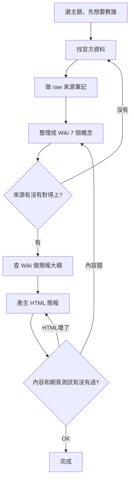

# 我這次的流程圖

```mermaid
flowchart TD
 A[選主題，先想要教誰] --> B[找官方資料]
 B --> C[做 raw 來源筆記]
 C --> D[整理成 Wiki 7 個概念]
 D --> E{來源有沒有對得上?}
 E -- 沒有 --> B
 E -- 有 --> F[查 Wiki 做簡報大綱]
 F --> G[產生 HTML 簡報]
 G --> H{內容和網頁測試有沒有過?}
 H -- 內容錯 --> D
 H -- HTML壞了 --> G
 H -- OK --> I[完成]
```

會重複的地方：缺資料回去找，概念對不起來源回 Wiki 改，按鈕或版面壞掉回 HTML 改。

為什麼要這樣：如果只在簡報表面修字，真正的 Wiki 可能還是錯的。先把來源和概念修好比較不容易一直犯同樣錯。
